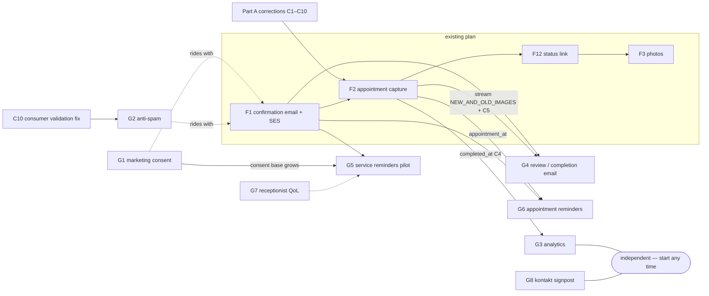

# Product & Growth Implementation Spec — corrections layer + new work items (G1–G9)

> Author perspective: Senior Software Architect
> Date: 2026-07-11
> Primary input: `docs/business-capabilities-review.md` (§4 gaps, §8 recommendations)
> Authoritative override: `docs/consultancy-summary.md` §"Owner answers received (2026-07-04)"
> Builds on (does NOT re-specify): `features-development-spec.md`, `features-implementation-plan.md` (F1, F2, F12, F3)
>
> Language: spec in English; **all customer-facing copy (emails, labels, consent text) in Polish.**

---

## Confirmed ground truth (owner, 2026-07-04 — overrides the feature spec)

| Enum value (`RepairRequestStatus`) | Meaning (owner-confirmed) | Live portal label | Timestamp today |
|---|---|---|---|
| `NEW` | Request submitted, not yet contacted | "Nowe" | `submittedAt` (UTC) |
| `HANDLED` | Client contacted, **appointment booked** | "Umówiono" | `handled_at` (set on entry) |
| `APPOINTMENT_MADE` | **Visit done, car fixed** — terminal | "Zakończono" | *(none — gap, see C4)* |

- The live labels in `repair-requests-portal/src/app/commons/status-mapper.ts` are **CORRECT** (verified 2026-07-11: `HANDLED`→"Umówiono", `APPOINTMENT_MADE`→"Zakończono"). It is `features-development-spec.md` that is wrong.
- The pipeline, in the shop's words: **Nowe → Umówiono (+ appointment date) → Zakończono.** In enum terms: **`NEW` → `HANDLED` → `APPOINTMENT_MADE`.**
- The "appointment confirmed" email belongs on the transition **to `HANDLED`**; the completion (and review-request, G4) email belongs on the transition **to `APPOINTMENT_MADE`**.
- **Do NOT rename the enums.** The names are misleading but synced across four places (shop enum, consumer's `status_value` literal, admin status-mapper strings, notification-Lambda / future status-Lambda string comparisons). Document instead (C9).
- **Production `/submit` is the consumer Lambda** (`repair-request-submitted-consumer`), not the monolith. Any public-form change lands there first.

Verified admin flow (2026-07-11, `repair-request-summary.component.html:110–119`): button **"Obsłużone"** shows on `NEW` and calls `mark-as-handled`; button **"Wizyta odbyta"** shows on `HANDLED` and calls `mark-as-appointment-made`; no actions on `APPOINTMENT_MADE`. This matches the confirmed semantics — the *code flow* is right; the *feature spec's description of it* is inverted.

---

# Part A — Corrections & alignment layer for F1 / F2 / F12 / F3

Anyone implementing from `features-development-spec.md` / `features-implementation-plan.md` must apply the following corrections. F1 and F3 are unaffected except where noted. **F2 is the heavily affected feature** — implemented as written, it would email "appointment confirmed" when the visit is already over.

### C1 — Fix the status-model statement (spec §0.5, section B1)

- Spec §0.5 says the status model is "`NEW → APPOINTMENT_MADE → HANDLED`". **Wrong.** The confirmed model is `NEW → HANDLED → APPOINTMENT_MADE` (see ground-truth table above).
- Spec section B1 (marked done) describes the current `status-mapper.ts` mapping as "inverted relative to backend semantics" and its checked-off operations record the **opposite** mapping as the fix. This text is obsolete: the June 23 "Fix status mapping" commit re-swapped the labels to the owner-confirmed truth. **Nobody may "re-fix" `status-mapper.ts` back.** The current file is correct as-is.

### C2 — Feature 2: appointment data is captured on the transition to `HANDLED`, not `APPOINTMENT_MADE`

Everything in spec §2.1–§2.5 and plan Feature 2 that binds appointment capture to `APPOINTMENT_MADE` moves to `HANDLED`:

- Attribute names stay as planned (`appointment_at`, `appointment_end_at`, `appointment_note`) — only the **transition that writes them** changes.
- The endpoint gaining the request body is **`POST /api/internal/repair-request/{id}/mark-as-handled`** (plan Step 2.3.1 names `mark-as-appointment-made` — swap). The `MarkAppointmentRequest` record itself is fine as drafted.
- **`MarkAsHandledCommandHandler`** gains the payload + availability validation (plan Step 2.3.2 logic, unchanged in content). **`MarkAsAppointmentMadeCommandHandler`** stays parameterless — it is now the *completion* action.
- Plan decision **D4 must be re-read under the corrected semantics.** As written ("allow direct `NEW→HANDLED` = close without appointment") it assumed `HANDLED` = closed. Corrected interpretation:
  - Direct close without booking = **`NEW → APPOINTMENT_MADE`** (walk-in handled off-pipeline, duplicate, abandoned). Recommended: keep allowed (see C3; confirm with owner — open question Q7).
  - Reschedule = **`HANDLED → HANDLED`** (re-sends the appointment email).
  - Terminal state = **`APPOINTMENT_MADE`**.

### C3 — Target state machine (replaces plan Step 2.2 transition table)

| From | Action (endpoint) | To | Effects |
|---|---|---|---|
| `NEW` | Book appointment — `mark-as-handled` + body | `HANDLED` | set `appointment_*`; set `handled_at` (= booking timestamp) |
| `HANDLED` | Reschedule — `mark-as-handled` + body | `HANDLED` | update `appointment_*`; re-send appointment email |
| `HANDLED` | Complete — `mark-as-appointment-made` | `APPOINTMENT_MADE` | set `completed_at` (new, C4) |
| `NEW` | Direct close — `mark-as-appointment-made` | `APPOINTMENT_MADE` | set `completed_at`; no appointment fields; **no appointment email** |
| `APPOINTMENT_MADE` | any | — | throw `RepairRequestStateException` (terminal) |

Code deltas vs today (all in `car-repair-shop-backend/shop/src/main/java/car/repair/shop/repair/request/`):
- `RepairRequest.markAsHandled()` → becomes `markAsHandled(LocalDateTime at, LocalDateTime endAt, String note)`: sets status `HANDLED`, `handled_at = now`, appointment fields. (Keep the attribute name `handled_at`; document that it means "booked at" — do not rename, existing data.)
- `RepairRequest.maskAsAppointmentMade()` (note the existing typo) → sets status `APPOINTMENT_MADE` **and `completed_at = now`**; fix the typo to `markAsAppointmentMade` while touching it (private to the module — safe).
- `NewRepairRequest.markAsAppointmentMade()` → **remove the `markAsHandled()` co-call** (the conflation, verified at `NewRepairRequest.java:16–19`); it must only complete.
- `HandledRepairRequest.markAsHandled()` → currently throws; **must allow** (reschedule).
- `AppointmentMadeRepairRequest` → already terminal for both actions; keep.
- Historical rows: `APPOINTMENT_MADE` rows with `handled_at` set are *expected* under the corrected model (booked, then completed) and also exist from the old conflated logic. Display keys off `status` only; no backfill.

### C4 — New attribute `completed_at` (addition to spec §2.2 data model)

Set when entering `APPOINTMENT_MADE`. Needed by: G3 (funnel: completed-per-month), G4 (send-once bookkeeping/audit), future RODO retention clock. Add to: `RepairRequest` entity (+`LocalDateTimeConverter`), `RepairRequestDto`, admin TS model `repair-requests-portal/src/app/models/repair-request.ts`, and display in `repair-request-summary`. Only the monolith writes it — do **not** add to the consumer's `RepairRequestItemConverter`.

### C5 — Email triggers in the notification Lambda (replaces spec §2.5 / plan Step 2.5)

In `new-repair-request-notification-lambda` (`NewRepairRequestSubmittedSnsNotifier.handleRequest` + the F1 `CustomerConfirmationEmailSender`), with stream `NEW_AND_OLD_IMAGES` (plan Step 2.6 unchanged):

| Stream event | Condition | Email |
|---|---|---|
| `INSERT` | — | F1 confirmation ("Otrzymaliśmy Twoje zgłoszenie") — unchanged |
| `MODIFY` | new `status_value` = `HANDLED` AND (old `status_value` ≠ `HANDLED` OR `appointment_at` changed) | **Appointment confirmation** — subject e.g. `"Potwierdzenie terminu wizyty w RENO CAR — {data, godzina}"` |
| `MODIFY` | new `status_value` = `APPOINTMENT_MADE` AND old `status_value` ≠ `APPOINTMENT_MADE` | **Completion email** — subject e.g. `"Dziękujemy za wizytę w RENO CAR"` (G4's review link lives here) |
| `MODIFY` | anything else (e.g. G7 note/contact edits, G6 `reminder_sent_at` writes) | **no email** |

Plan Step 2.8.2 test matrix swaps accordingly: MODIFY→`HANDLED` with `appointment_at` ⇒ appointment email; MODIFY→`APPOINTMENT_MADE` ⇒ completion email (not "no email"); reschedule (still `HANDLED`, `appointment_at` changed) ⇒ re-send; attribute-only MODIFY ⇒ nothing.

### C6 — Admin UI (replaces plan Step 2.4.1 placement)

The appointment date/time dialog attaches to the **"Obsłużone"** button (the `NEW → HANDLED` action) in `repair-request-summary.component`, not to "Wizyta odbyta". Recommended label changes while touching it (Polish, clearer):
- `NEW`: "Obsłużone" → **"Umów wizytę"** (opens the appointment dialog).
- `HANDLED`: add **"Zmień termin"** (same dialog, pre-filled — reschedule) alongside "Wizyta odbyta" (completion, no dialog).
- Row colours/chips in `status-mapper.ts` unchanged.

### C7 — Feature 12 timeline mapping (clarifies plan Step 12.6.3)

The Polish timeline "Otrzymano → Umówiono (with date) → Zakończono" is correct; the **code mapping** is `NEW`→"Otrzymano", **`HANDLED`→"Umówiono" (+ `appointment_at`)**, **`APPOINTMENT_MADE`→"Zakończono"**. Add `completed_at` to the `TrackingTokenIndex` projection INCLUDE list (plan Step 12.2.1) if the status page should show the completion date (optional, cheap).

### C8 — Feature 2 acceptance criteria (replaces plan "Feature 2 acceptance")

Staff set/reschedule an appointment **when marking a request "Umówiono" (`HANDLED`)** with server-side availability validation; the customer receives the appointment email at that moment; marking "Wizyta odbyta" (`APPOINTMENT_MADE`) sets `completed_at`, sends the completion email, and is terminal; direct close `NEW → APPOINTMENT_MADE` remains possible (no appointment email); no email is ever sent for note/contact/reminder-flag edits.

### C9 — Documentation duty (instead of renaming)

Add a Javadoc block to `car/repair/shop/repair/request/RepairRequestStatus.java` stating the label mapping and warning that the names are historical and must not be "fixed" by renaming (4 synced modules). Mirror one-line comments at: consumer `RepairRequestItemConverter` (`status_value = "NEW"`), admin `status-mapper.ts`, and the notification Lambda's MODIFY branch.

### C10 — Prerequisite production bug fix (before G2 / alongside F1)

The consumer Lambda validates with jakarta `Validator` (`RepairRequestSubmittedHandler.java:45–48`), but the DTO's `@NotNull` is `software.amazon.awssdk.annotations.NotNull` (`SubmitRepairRequestDto.java:6`) — a no-op — and a null `timeSlots` NPEs at `RepairRequestItemConverter.java:19` (customer-facing 502). Fix (swap to `jakarta.validation.constraints.NotNull`, null-guard `timeSlots` → empty list) **before** G2 exposes these paths to bot traffic. Tracked as consultancy critical item 3; listed here only as a dependency.

---

# Part B — New work items (G1–G9), ordered by value-for-effort

Effort scale: **S** = hours, **M** = days, **L** = week+.

---

## G1 — Marketing-consent checkbox on the submission form

**Goal & value.** One optional checkbox + one stored boolean legally unlocks every future reminder and promotion (G4 option b, G5, future campaigns) to the customer base the shop is already collecting. Retrofitting consent onto past submissions is practically impossible — every week of delay permanently shrinks the usable base. Rides along with Feature 1 while the form and both write paths are being touched anyway.

**Affected modules & files.**
- `submission-portal/src/app/repair-request-submission/repair-request-submission.component.ts` + `.html` (+ `.spec.ts`), `submission-portal/src/app/models/repair-request.ts`
- `car-repair-shop-backend/repair-request-submitted-consumer/src/main/java/car/repair/shop/SubmitRepairRequestDto.java`, `RepairRequestItemConverter.java` (+ converter test)
- `car-repair-shop-backend/shop/src/main/java/car/repair/shop/repair/request/controller/dto/SubmitRepairRequestDto.java`, `repair/request/RepairRequest.java`, `controller/dto/RepairRequestDto.java`
- `repair-requests-portal/src/app/models/repair-request.ts`, `components/repair-request-summary/repair-request-summary.component.html`

**Design & implementation steps.**
1. Form: add `marketingConsent: new FormControl(false)` — **no validator** (optional), default unchecked, rendered *below* the required RODO checkbox with visibly distinct copy (Polish, below). Include in the submit payload.
2. Consumer DTO: add `boolean marketingConsent` (primitive → absent JSON field deserializes to `false`, keeping old clients compatible). Converter: `item.put("marketing_consent", numberAttribute(dto.marketingConsent()))` — mirror the existing `rodo` attribute.
3. Shop path (dual-path rule, spec §0.1): same field on the shop `SubmitRepairRequestDto`, `@DynamoDBAttribute(attributeName = "marketing_consent")` on the entity, mapped through `RepairRequestDto`.
4. Admin portal: show "Zgoda marketingowa: Tak / Nie" in the request summary. Treat missing attribute (all historical rows) as **Nie**.
5. Tests: converter emits `marketing_consent` 0/1; absent field → 0; DTO round-trip; form spec (checkbox optional, submits both states).
6. **Deploy order: consumer Lambda first, then the portal.** The consumer's `ObjectMapper` uses default `FAIL_ON_UNKNOWN_PROPERTIES` — a portal sending the new field to the old Lambda would 500 every submission.

**Consent copy (Polish, customer-facing):**
> ☐ Chcę otrzymywać od RENO CAR przypomnienia serwisowe (np. o wymianie opon lub przeglądzie) oraz informacje o promocjach — e-mailem lub SMS-em. Zgoda jest dobrowolna i mogę ją wycofać w każdej chwili, kontaktując się z warsztatem.

**Data model / API.** New DynamoDB attribute `marketing_consent` (N, 0/1). Submit API body gains optional `marketingConsent` boolean. No index changes.

**Effort.** S (half a day incl. tests).

**Dependencies.** None hard; ship inside the F1 change set. Deploy-order constraint above.

**Risks & mitigations.** (a) Consent proof: the boolean + `submittedAt` + the consent wording versioned in git constitute the RODO consent record — add the wording and its date to `car-repair-shop-backend/infrastructure/RUNBOOK.md` whenever the copy changes. (b) Withdrawal: until an admin toggle exists (bundle with G7's edit capability), withdrawal is a manual DB update — document the `aws dynamodb update-item` one-liner in the RUNBOOK.

**Acceptance criteria.** Submission with the box unchecked stores `marketing_consent=0` and behaves exactly as today; checked stores `1`; admin summary shows Tak/Nie; historical rows display "Nie"; a payload without the field is accepted (old cached frontend).

**RODO.** Art. 6(1)(a) consent, freely given, separate from the required processing consent, unchecked by default, withdrawal path stated in the copy. Update the privacy policy (marketing purpose, channels e-mail/SMS, withdrawal). Consent scope covers both reminders and promotions — confirm channel scope (e-mail only vs e-mail+SMS) with the owner (Q8); the copy above covers both.

---

## G2 — Anti-spam on the public form (replace the localStorage lockout)

**Goal & value.** The only protection today is a client-side "one submission per day" localStorage flag (`repair-request-submission.component.ts:76–83, 144–145`) that blocks *legitimate* customers (second car, typo fix) and stops zero bots. Once F1 emails on every submission, an unprotected endpoint burns SES sender reputation (bounce spike → SES suspension → **all** customer email stops). This item protects the flagship feature and removes a real conversion blocker.

**Decision: Cloudflare Turnstile (Managed mode), not reCAPTCHA.** Free, no fixed cost (WAF stays out per plan defaults), no Google-cookie baggage (much lighter RODO story), works inside iframes (the form is iframed into renocar.pl — verified in `renocar-webpage/httpdocs/index.htm` and `umow-sie/index.htm`). reCAPTCHA v3 is the fallback if Turnstile is rejected.

**Affected modules & files.**
- `submission-portal/src/index.html` (Turnstile script), `src/app/repair-request-submission/repair-request-submission.component.ts` + `.html`, `src/app/models/repair-request.ts`
- `car-repair-shop-backend/repair-request-submitted-consumer/src/main/java/car/repair/shop/RepairRequestSubmittedHandler.java`, `SubmitRepairRequestDto.java`, new `TurnstileVerifier.java` (+ tests)
- AWS console (runbook): API Gateway throttling on the submit route
- Prerequisite: C10 validation fix in the same module

**Design & implementation steps.**
1. Create a Turnstile site in Cloudflare (free account) for hostname `renocar-zgloszenie.pl`. Record sitekey/secret in the RUNBOOK (secret only as an env-var reference, never committed).
2. Frontend: render the Turnstile widget (explicit render, `language: 'pl'`) above the submit button; store the token in a hidden form control `captchaToken`; disable submit until a token exists; refresh token on submit error (tokens are single-use, 300 s validity).
3. Payload: add `captchaToken` to the submit request model.
4. Consumer Lambda: add `captchaToken` to the DTO (excluded from the DynamoDB item). Before jakarta validation, call `TurnstileVerifier.verify(token, remoteIp)` — `java.net.http.HttpClient` POST to `https://challenges.cloudflare.com/turnstile/v0/siteverify` with env var `TURNSTILE_SECRET_KEY`; on failure return 400 with a Polish-friendly error body. **Fail closed** (siteverify unreachable ⇒ 400 with "spróbuj ponownie lub zadzwoń" messaging) — simplicity over an attacker-triggerable fail-open; siteverify availability is excellent.
5. Remove the localStorage block: delete the `submitted-date` read in `ngOnInit` and the `localStorage.setItem` on success; replace the post-submit screen with the existing thank-you plus a "Wyślij kolejne zgłoszenie" button that resets the form.
6. Server-side throttling (runbook): API Gateway stage/route throttle on `POST /submit` — rate 2 req/s, burst 5 (tens of requests *per day* is the legit load). No WAF (avoids the ~$5+/month fixed cost, per plan defaults).
7. Dev/test: use Cloudflare's documented always-pass test sitekey/secret in `environment.development.ts` and unit tests; mock `TurnstileVerifier` in handler tests.
8. Tests: valid token → stored; invalid/missing token → 400, nothing stored, no SNS/SES side effects; verifier failure → 400.

**Data model / API.** Submit API body gains required `captchaToken` (string). No persistence change. New Lambda env var `TURNSTILE_SECRET_KEY`.

**Effort.** M (~1 day + the C10 fix).

**Dependencies.** C10 (ship together — bots will find the NPE path otherwise). Coordinated deploy with F1's go-live; frontend and Lambda must ship together (old frontend without token ⇒ 400 — deploy Lambda accepting *missing* token for a 24 h grace window, then flip `TURNSTILE_REQUIRED=true`; document in runbook).

**Risks & mitigations.** (a) Iframe embedding: Turnstile validates the *iframe's* origin (`renocar-zgloszenie.pl`) — matches the site config; test from within renocar.pl early. (b) Accessibility/false positives: Managed mode is mostly invisible; keep the phone number visible near the form as the analog fallback. (c) Token expiry during slow form fill: refresh on submit failure (step 2).

**Acceptance criteria.** A normal customer can submit twice in one day; a submission without a valid token is rejected server-side; burst-curl against the endpoint hits the API Gateway throttle; SES/SNS never fire for rejected submissions; the form works inside the renocar.pl iframe.

**RODO.** Turnstile processes IP/user-agent — add Cloudflare to the privacy policy processor list. No cookies requiring consent in non-interactive mode.

---

## G3 — Analytics & funnel measurement

**Goal & value.** The business is flying blind: renocar.pl ships a dead `ga.js`/UA tag (verified on all 8 `index.htm` pages, account `UA-29684621-1` — collecting nothing since 2023) and the submission portal has no analytics at all. Every prioritisation decision (G5, G8, G9) is currently a guess. Near-zero cost to fix; the funnel's bottom half (submitted→booked→completed) already exists as statuses+timestamps in DynamoDB.

**Decision: GA4 with a consent banner (recommended, free).** Alternative: Plausible (~€9/month, cookieless, no banner needed, EU-hosted — cleaner RODO, real recurring cost). Given the platform's aggressive cost discipline, default to GA4 behind consent; switch to Plausible only if the owner prefers paying to avoid a banner (Q6).

**Affected modules & files.**
- `renocar-webpage/httpdocs/index.htm` + `oferta/`, `ofirmie/`, `kontakt/`, `promocje/`, `mechanicy/`, `umow-sie/`, `cookies/` `index.htm` (all 8 carry the dead tag — no templating, edit each), `renocar-webpage/httpdocs/js/cookies-info.js` (upgrade or add `js/consent.js`)
- `submission-portal/src/index.html`, `src/app/repair-request-submission/repair-request-submission.component.ts` (events)
- `car-repair-shop-backend/infrastructure/RUNBOOK.md` (monthly funnel query)

**Design & implementation steps.**
1. Create a GA4 property; one property, two data streams (renocar.pl, renocar-zgloszenie.pl).
2. renocar.pl: remove the `_gaq`/`ga.js` block from **every** `index.htm`; upgrade the existing cookie-info bar to a two-button consent bar ("Zgadzam się" / "Nie zgadzam się"), decision persisted in `localStorage`; inject the `gtag.js` snippet **only after acceptance** (and on subsequent visits with stored acceptance). Keep it dependency-free vanilla JS (module convention: no build step).
3. renocar.pl events: `click_umow_sie` (the "Umów się online" CTAs), `tel_click` (on `tel:` links) — these are the acquisition signals.
4. Submission portal: same consent-gated GA4 in `src/index.html`. **Iframe caveat:** most traffic arrives inside the renocar.pl iframe where a second banner is hostile UX; suppress the banner when `window.self !== window.top` and send **no analytics** in that case (strict-consent-safe). Direct visits to renocar-zgloszenie.pl get the banner. The submission *count* does not depend on this — it comes from the DB (step 5). Track `form_submit_success` / `form_submit_error` when consent exists.
5. Funnel from the `repair_request` table (server-side truth, no consent needed — legitimate-interest internal statistics on data already held): document in the RUNBOOK a monthly query counting, per month: submitted (`submittedAt`), booked (`handled_at`), completed (`completed_at` — exists after F2+C4; until then count `status_value` totals). Implementation: one documented `aws dynamodb scan --projection-expression "submittedAt, handled_at, completed_at, status_value"` + a jq one-liner; at a few thousand items this costs cents. (A stats card in the admin portal is a possible later G7 follow-on — do not build now.)
6. Owner habit: a RUNBOOK checklist — first working day of the month, record visits / CTA clicks (GA4) and submitted→booked→completed (DB) into a simple sheet.

**Data model / API.** None. (C4's `completed_at` is the only schema touch, delivered by F2.)

**Effort.** M (1–2 days across both sites incl. the consent bar).

**Dependencies.** None to start (GA4 + banner + dead-tag removal ship any time). Full funnel depth needs F2+C4 (`completed_at`).

**Risks & mitigations.** (a) GA4/EU data-transfer criticism — mitigated by consent gating + IP anonymisation (GA4 default); Plausible is the escape hatch. (b) Consent-wall skew: accept it; the decision-grade numbers (submissions, bookings) come from the DB, not GA. (c) Editing 8 legacy HTML files: follow `renocar-webpage/CLAUDE.md` encoding pitfalls; verify Polish diacritics after edits.

**Acceptance criteria.** Dead `ga.js` gone from all pages; no analytics request fires before consent (verify in DevTools network tab); after consent, page views + `click_umow_sie` + `tel_click` appear in GA4 realtime; the RUNBOOK query returns the three monthly counts; cookies policy page updated.

**RODO.** Analytics cookies only after opt-in (ePrivacy/PT art. 173); update `cookies/index.htm` policy text (which also still names the dissolved legal entity — fix rides with the entity correction tracked in the consultancy summary); list Google as processor. The DB funnel count uses already-held data for internal statistics — legitimate interest, no consent needed.

---

## G4 — Post-visit Google-review request email (on "Zakończono")

**Goal & value.** Google review count/rating is the highest-ROI local-marketing asset a workshop owns. The trigger event (transition to `APPOINTMENT_MADE` = "Zakończono") already exists in the portal, and F1's SES foundation makes this a small increment: the review ask lives **inside the completion email** defined by C5 — one email, one send-guard, no new infra.

**Affected modules & files.**
- `car-repair-shop-backend/new-repair-request-notification-lambda/src/main/java/car/repair/shop/notification/` — extend the F1 `CustomerConfirmationEmailSender` with `sendCompletionEmail(...)`; MODIFY branch per C5 (+ tests in `src/test/java/`)
- Lambda env var `GOOGLE_REVIEW_URL`
- RUNBOOK (Place-ID capture procedure)

**Design & implementation steps.**
1. Obtain the shop's Google Place ID (owner has GBP manager access — separate GBP session already planned); build the direct link `https://search.google.com/local/writereview?placeid=<PLACE_ID>`; set as `GOOGLE_REVIEW_URL` env var.
2. Implement the completion email (C5 row 3): triggered on MODIFY where old status ≠ `APPOINTMENT_MADE` and new = `APPOINTMENT_MADE`. Read `email`, `submitter_first_name`, `tracking_token` (post-F12) from the new image. Skip silently if `email` blank (F1 guard pattern).
3. **Send-once guarantee:** `APPOINTMENT_MADE` is terminal (C3), so the status transition happens exactly once; later attribute-only MODIFYs (G7 notes, contact edits) fail the old≠new condition. At-least-once stream delivery may rarely duplicate — accepted, consistent with the plan's F1 idempotency default.
4. Copy decision (legal, Q5): recommended **variant (a)** — send to *all* customers as a transactional completion notice with a neutral, non-promotional review ask (widely treated as service communication). Fallback **variant (b)** if the owner's RODO reference objects: include the review paragraph only when `marketing_consent=1` (available in the stream image thanks to G1) — one `if` around one paragraph.
5. Tests: transition → email with review link; repeat MODIFY (same status) → no email; blank email → no send; variant-(b) flag behaviour if adopted.

**Email copy (Polish):**
> **Temat:** Dziękujemy za wizytę w RENO CAR
>
> Dzień dobry {imię},
>
> dziękujemy za skorzystanie z usług naszego warsztatu. Twoje zgłoszenie zostało zakończone — samochód jest gotowy.
>
> Będziemy bardzo wdzięczni za podzielenie się opinią — zajmie to mniej niż minutę:
> **[Oceń nas w Google]** ({GOOGLE_REVIEW_URL})
>
> W razie pytań prosimy o kontakt: tel. {telefon warsztatu}.
>
> Pozdrawiamy,
> Zespół RENO CAR

**Data model / API.** None. One env var.

**Effort.** S (half a day on top of the F2/C5 MODIFY plumbing).

**Dependencies.** F1 (SES + sender), F2 Step 2.6 (`NEW_AND_OLD_IMAGES` stream) — hard. G1 only if variant (b). F12 optional (status link in footer).

**Risks & mitigations.** (a) Legal grey zone of unsolicited review asks (UŚUDE art. 10 / PT art. 172) — variant (b) is the pre-built retreat; keep wording non-promotional either way (no offers, no discounts in this email). (b) Review-gating rules: never filter by expected sentiment (against Google policy) — ask everyone the same way. (c) Wrong moment: the trigger is the receptionist's "Wizyta odbyta" click; if clicked late, the email is late — acceptable; note in the receptionist's one-pager that the click now emails the customer.

**Acceptance criteria.** Marking a request "Wizyta odbyta" sends exactly one completion email containing the working review link; editing notes/contact on a completed request sends nothing; the link opens the Google review dialog for the correct business.

**RODO.** Variant (a): legitimate-interest service communication, documented in the privacy policy. Variant (b): consent-scoped. Either way no new data stored.

---

## G8 — Second intake channel: renocar.pl contact form

**Goal & value.** Leads sent through the renocar.pl kontakt form go to the `info@renocar.pl` inbox (verified: `httpdocs/kontakt/handler.php` → `sendEmailTo('info@renocar.pl')`) and never enter the pipeline — no status, no alert, no (post-F1) confirmation. Every *booking-intent* lead should land where the pipeline exists; every *general question* should stay out of it. Two options specified; B recommended.

**Option A — unify into the pipeline.** Variants:
- **A1 (redirect):** replace the kontakt form with a prominent link to the request form. Rejected: kills the legitimate "general question" channel (invoices, parts questions, opinions).
- **A2 (dual intake):** keep the form; extend `handler.php` to *also* POST general inquiries to a new public endpoint → new `inquiry` DynamoDB item type or table → notification + a new admin-portal section. Cost: new Lambda route or item type, admin UI, spam surface on a second public endpoint, and the pipeline's data model (plate required, vehicle-centric) does not fit message-only leads. Effort M–L. **Not recommended at current volume** — revisit only if G3/Q1 shows meaningful booking-intent traffic through kontakt.

**Option B — clarify & signpost (recommended).** Relabel the kontakt form "general questions only" and aggressively signpost booking intent to the request form.

**Affected modules & files (Option B).**
- `renocar-webpage/httpdocs/kontakt/index.htm` (copy + signpost button; also fix the `type="phone"`→`type="tel"` input while there — PLAN.md item)
- Optionally `httpdocs/kontakt/form.js` (no logic change needed)

**Design & implementation steps (Option B).**
1. Above the kontakt form, add a highlighted box (reusing the site's existing Bootstrap 3 alert/panel styles):
   > **Chcesz umówić naprawę lub przegląd?** Skorzystaj z formularza zgłoszeniowego — otrzymasz potwierdzenie e-mailem, a my skontaktujemy się z Tobą w sprawie terminu.
   > **[Umów wizytę online →]** (link to `/umow-sie/`)
2. Retitle the form section: **"Formularz kontaktowy — pytania ogólne"** with subtext: "Na wiadomości odpowiadamy e-mailem lub telefonicznie. Zgłoszenia naprawy prosimy składać przez formularz zgłoszeniowy powyżej."
3. Count the redirect: give the signpost link a GA4 event (`click_umow_sie_from_kontakt`, rides on G3's tag).
4. Ask the owner to track kontakt-inbox volume for a month (Q1/Q11 from the review) — this is the evidence gate for ever building A2.

**Data model / API.** None (Option B).

**Effort.** S (Option B, ~2 h). A2: M–L (documented above only as an option).

**Dependencies.** None. G3 for the measurement event (soft).

**Risks & mitigations.** Duplicated header/footer across pages — this change is kontakt-page-only, no cross-page sync needed. Keep encoding intact per `renocar-webpage/CLAUDE.md`.

**Acceptance criteria.** Kontakt page clearly routes booking intent to the request form; the form still delivers general questions to `info@renocar.pl`; the signpost click is measurable in GA4.

---

## G7 — Receptionist quality-of-life: search, status filter, notes, contact correction

**Goal & value.** The queue (`repair-request-table`) is a paginated list with no search or filter — finding "the request from Mr. Kowalski" means paging; completed requests share the list with new ones forever. There is no notes field ("left voicemail twice" lives in someone's head) and no way to fix a typo'd phone number (typo = dead lead, and post-F1 a typo'd email = bounced confirmations feeding SES bounce rate). Small, unglamorous changes to the tool's most-used screen.

**Affected modules & files.**
- Shop: `car-repair-shop-backend/shop/src/main/java/car/repair/shop/repair/request/` — `SearchRepairRequestHandler.java`, `query/SearchRepairRequestQuery.java`, `RepairRequestSearchRepository.java`, `RepairRequest.java`, new `UpdateNotesCommandHandler.java`, new `UpdateContactCommandHandler.java`, `controller/RepairRequestInternalController.java`, `controller/dto/RepairRequestDto.java`, `controller/dto/RepairRequestListItem.java` (+ unit/integration tests; LocalStack ITs need Docker)
- Admin portal: `repair-requests-portal/src/app/components/repair-request-table/repair-request-table.component.ts` + `.html`, `components/repair-request-summary/repair-request-summary.component.ts` + `.html`, `service/repair-request-service.ts`, `models/repair-request.ts`
- Reuse `car/repair/shop/commons/patterns/PhoneNumberPattern.java` for contact validation.

**Design & implementation steps.**
1. **Search + status filter (backend).** Extend `SearchRepairRequestQuery` with optional `status` and `text`. Implementation sized to reality (table = a few thousand items max, each <2 KB): when either filter is present, page through the `SubmittedAtIndex` partition (the existing `findByDummyPartitionKey` access path), filter in memory (case-insensitive substring over first/last name and plate; exact enum match for status), and build the `Page` manually preserving sort. Document the scaling ceiling (~10 k rows) in a comment; a `status_value` GSI is the future fix, not needed now. No new index today.
2. **Search + filter (API/UI).** `GET /api/internal/repair-request/search` gains `&status=&text=`; table component gets a debounced (300 ms) text input ("Szukaj: imię, nazwisko, nr rejestracyjny") and a status `mat-select` ("Wszystkie / Nowe / Umówiono / Zakończono" — labels via the existing `StatusMapper`), both resetting to page 0 on change.
3. **Notes.** New attribute `staff_notes` (S, free text, max 2000 chars — validated). Endpoint `PUT /api/internal/repair-request/{id}/notes` body `{ "notes": "..." }`, allowed in **any** status (annotating a completed request is legitimate). Summary component: textarea + "Zapisz notatkę" button, label "Notatki wewnętrzne (niewidoczne dla klienta)". Per C5, an attribute-only MODIFY sends no email — covered by the status-transition guards; add a regression test.
4. **Contact correction.** Endpoint `PUT /api/internal/repair-request/{id}/contact` body `{ firstName, lastName, email, phoneNumber }` with jakarta validation (`@Email`, `PhoneNumberPattern`, `@NotBlank`). Summary: an "Edytuj dane kontaktowe" pencil-icon dialog pre-filled with current values. Any status allowed. Optional single audit attribute `contact_updated_at` (recommended — one line).
5. **Consent withdrawal ride-along (from G1):** the contact dialog also exposes the `marketing_consent` toggle so the receptionist can record a withdrawal without a developer.
6. Tests: handler filter combinations; notes length validation; contact validation (bad email/phone → 400); stream-guard regression (note edit ⇒ no email); table spec for filter → service params; dialog spec.

**Data model / API.**
- New attributes: `staff_notes` (S), optional `contact_updated_at` (S, ISO). Written only by the monolith — no consumer-converter change (dual-path rule: consumer never sets them; document).
- API: `search` gains 2 optional query params; 2 new PUT endpoints returning the updated `RepairRequestDto`. `RepairRequestListItem` unchanged unless the table should show a note indicator (nice-to-have, skip).
- **Never** expose `staff_notes` / contact-audit via F12's public DTO — the allowlist design (plan Step 12.3.3) already guarantees this; add an explicit test assertion.

**Effort.** M (2–4 days incl. tests).

**Dependencies.** None hard. G1 for step 5. Coordinated deploy: shop jar + admin portal together (new endpoints; search params are backward-compatible).

**Risks & mitigations.** (a) In-memory filtering cost — bounded by table size; ceiling documented; measured via the existing pagination path. (b) Contact edits after F1 emails sent — correcting email means *future* emails (appointment, completion) reach the customer; the already-bounced confirmation is not re-sent (acceptable; note for the receptionist). (c) Editing PII — internal, JWT-guarded endpoints only; the single-shared-account limitation (no per-user audit) is a known, accepted constraint at this staffing level.

**Acceptance criteria.** Receptionist finds a request by surname or plate fragment in one interaction; filters the queue to "Nowe"; saves a note and sees it after reload; fixes a phone typo and the detail view shows the corrected number; no customer email is triggered by any of these edits; status page (F12) never shows notes.

**RODO.** Contact correction is actually an art. 16 (rectification) capability — positive. Notes are personal data: instruct staff (one line in the portal UI label, done in step 3) to keep them factual and service-related; notes fall under the same retention as the request record.

---

## G6 — Appointment reminders (day-before email; SMS optional phase 2)

**Goal & value.** Once F2 records `appointment_at`, a day-before reminder directly attacks no-shows — an empty bay hour is unrecoverable, and one prevented no-show per month pays for the entire mechanism many times over. Email first (free on the F1 SES foundation); SMS as an evidence-gated second phase.

**Affected modules & files.**
- `car-repair-shop-backend/new-repair-request-notification-lambda/` — new handler class `car.repair.shop.notification.AppointmentReminderHandler` in the **same Gradle module/artifact** (second Lambda *function* pointing at the same shaded jar, different handler — mirrors the module's cold-start-isolation philosophy without a fifth build), reusing `CustomerConfirmationEmailSender`'s SES client (+ tests)
- AWS (runbook): EventBridge Scheduler rule, second Lambda function + IAM
- RUNBOOK: schedule, env vars

**Design & implementation steps.**
1. EventBridge Scheduler: daily cron `16:00 Europe/Warsaw` (scheduler supports timezones natively — DST-safe) → `appointment-reminder` Lambda function (same jar, handler = `AppointmentReminderHandler`).
2. Handler logic: compute tomorrow's date (Europe/Warsaw); `Scan` `repair_request` with `FilterExpression: status_value = :handled AND begins_with(appointment_at, :tomorrowDate) AND attribute_not_exists(reminder_sent_at)`. A Scan is deliberate and sized to reality (few-thousand-item table, once daily ⇒ fractions of a cent); an `appointment_at` GSI is the documented future fix, not built now.
3. Per hit: send the reminder email (skip if `email` blank); on success `UpdateItem` set `reminder_sent_at = now` — the idempotency marker (a crashed run resumes safely; re-runs send nothing twice).
4. Stream interaction: the `reminder_sent_at` write produces a MODIFY with unchanged status/appointment — C5's guards ignore it (regression test in the notifier).
5. Timezone note: `appointment_at` is stored as Europe/Warsaw wall-clock (plan Step 2.4.4) — the `begins_with` date-prefix comparison is exact by design; add a comment referencing the convention.
6. IAM: `dynamodb:Scan` + `dynamodb:UpdateItem` on the table, `ses:SendEmail` on the identity. Env vars: reuse `SES_*`, add `REMINDER_ENABLED` kill-switch.
7. Tests: finds only tomorrow+`HANDLED`+unreminded; sets marker; blank email skipped; marker prevents resend; kill-switch honored.
8. **Phase 2 — SMS (decision-gated, do not build yet):** channel options: AWS SNS SMS (no new vendor; ~$0.045/msg to PL; generic sender) vs a Polish gateway (SMSAPI.pl — registered alphanumeric sender "RENOCAR", better deliverability, HTTP API). Gate on Q3 (no-show frequency/cost) and 2–3 months of email-reminder data. A reminder for a booked visit is service performance, not marketing — no marketing consent needed (document rationale), but note SMS in the privacy policy.

**Email copy (Polish):**
> **Temat:** Przypomnienie o jutrzejszej wizycie w RENO CAR — {data}, godz. {godzina}
>
> Dzień dobry {imię},
>
> przypominamy o umówionej wizycie w warsztacie RENO CAR:
> **{data (np. czwartek, 12.03.2026)}, godz. {godzina}**
> ul. {adres warsztatu}, Gdańsk
>
> Jeśli nie możesz przyjechać lub chcesz zmienić termin, prosimy o telefon: {telefon}.
>
> Do zobaczenia,
> Zespół RENO CAR

**Data model / API.** New attribute `reminder_sent_at` (S, ISO; written only by the reminder Lambda). No API changes. New infra: EventBridge schedule + Lambda function (runbook).

**Effort.** M (1–2 days). SMS phase 2: additional M + per-message cost.

**Dependencies.** **F2 (hard)** — `appointment_at` on `HANDLED` per C2/C3; F1 (SES). C5 guards (step 4).

**Risks & mitigations.** (a) Reschedule after reminder sent: if `appointment_at` changes (still `HANDLED`), the reminder for the *new* date must fire — clear `reminder_sent_at` in the monolith's reschedule path (`markAsHandled`, C3) — explicit sub-task and test. (b) Same-day bookings made after 16:00 for tomorrow get no reminder — accepted (the booking call just happened). (c) Silent failure of the schedule — CloudWatch alarm on the function's Errors + a zero-invocation alarm (runbook, aligns with plan §8.7).

**Acceptance criteria.** A `HANDLED` request with tomorrow's `appointment_at` receives exactly one reminder at ~16:00; nothing is sent for `NEW`/`APPOINTMENT_MADE`, past/later dates, or already-reminded items; reschedules re-arm the reminder; disabling the kill-switch stops sends without redeploy.

**RODO.** Transactional service communication (performance of the requested service) — lawful without marketing consent; mention the reminder in the privacy policy's communication section.

---

## G5 — Service-reminders pilot (manual first; automation gated)

**Goal & value.** Seasonal tires, oil changes, and annual inspections are the classic recurring-revenue engine of a Polish workshop — the review calls this **the single largest untapped revenue lever**. The on-site Firebird DB holds service history, and `car-repair-shop-ai-chat/` proves it is readable. Start with a manual, once-per-season campaign to consented customers; automate only if the pilot fills bays.

**Affected modules & files (pilot = process + queries, minimal code).**
- `car-repair-shop-ai-chat/app/` (`database`, `query_engine`, `schema_context`, `safety`) — used as the read tool; possibly 1–2 saved SQL templates added beside it
- `repair_request` table (consent cross-match via `marketing_consent`)
- SES (F1 identity) as the send channel
- RUNBOOK: campaign procedure + suppression list location

**Design & implementation steps.**
1. **Prerequisites check (blocking):** G1 live long enough to have a consented base (suggest ≥50 contacts — expect ~3–6 months of collection); owner answers on Firebird reachability/export (Q2) and on-site-system capabilities (does it already do reminders? — review open question #4).
2. **Define the first campaign** with the owner. Best first pick: **October winter-tire change** (highest seasonal peak, simplest selection: customers with a tire-change job 10–14 months ago). Alternatives: inspection anniversaries (monthly), oil change by date.
3. **Selection query:** using the ai-chat module's read-only access, pull candidates (name, phone, email, last tire service date, vehicle) from Firebird. Verify the needed fields exist in the schema (`schema_context`) — open question if they don't.
4. **Consent cross-match:** export consented contacts (`marketing_consent=1`) from `repair_request` (documented `aws dynamodb scan`); match by email/phone against the Firebird candidate list (spreadsheet-level tooling at pilot scale). **Only the intersection is contacted.** Maintain a suppression list (anyone who opted out) checked before every campaign.
5. **Send:** personalised SES sends (a 30-line script using the F1 identity, or manual sends at first-pilot volume of likely <30 emails). Every message carries the withdrawal line.
6. **Measure:** receptionist tags resulting bookings ("z przypomnienia") in the request note (G7); count per campaign into the monthly numbers (G3).
7. **Automation criteria (all must hold before building anything):** pilot yields ≥5 attributable bookings per campaign (owner may adjust); Firebird is reachable/exportable on a schedule (Q2); consent base grows steadily; owner wants a recurring cadence. Automation sketch (deferred, **L**): scheduled Firebird export → matching job → SES batch — do not design further until the gate passes.

**Email copy (Polish, tire campaign):**
> **Temat:** RENO CAR — czas pomyśleć o oponach zimowych
>
> Dzień dobry {imię},
>
> zbliża się sezon zimowy. Według naszych zapisów ostatnia wymiana opon w Państwa aucie ({model/nr rej.}) odbyła się w {miesiąc rok}. Zapraszamy do umówienia wymiany — najlepsze terminy rozchodzą się szybko.
>
> **Umów wizytę online:** https://renocar-zgloszenie.pl/ lub telefonicznie: {telefon}.
>
> Pozdrawiamy,
> Zespół RENO CAR
>
> ---
> Otrzymujesz tę wiadomość, ponieważ wyraziłeś/aś zgodę na przypomnienia serwisowe od RENO CAR. Aby zrezygnować, odpisz „REZYGNACJA" lub skontaktuj się z warsztatem.

**Data model / API.** None for the pilot. (Automation would need an export contract with the on-site system — deferred.)

**Effort.** Pilot: M (1–2 days setup + hours per campaign). Automation: L (deferred behind the gate).

**Dependencies.** **G1 (hard — consent)**; F1 (SES); G7 (booking attribution notes, soft); G3 (measurement, soft); owner answers Q2.

**Risks & mitigations.** (a) Tiny initial consent base makes the first pilot look weak — set expectations; the base compounds monthly, which is precisely why G1 ships first. (b) Firebird data quality (missing emails, stale customers) — the consent cross-match inherently filters to recent, reachable customers. (c) Matching errors (emailing the wrong person about "their" car) — match on email exact + surname sanity check; when unsure, drop the record.

**Acceptance criteria.** First campaign sent to consented-intersection customers only; zero sends to non-consented or suppressed contacts; withdrawal handled within the campaign (suppression list updated); attributable bookings counted and reported against the automation gate.

**RODO.** Marketing — **consent required** (G1's scope covers reminders + promotions); Firebird selection on already-held data is legitimate-interest preparatory analysis, but the *electronic send* needs the consent (UŚUDE art. 10 / PT art. 172). Suppression list is mandatory. Update the privacy policy (profiling-light selection based on service history).

---

## G9 — Assessment-only entries (deliberately deferred)

Not specified for implementation. Recorded so the reasoning survives.

### G9.1 Customer estimates from parts-scraper results
**Why deferred:** the scraper is a *local shop-PC tool* with persistent supplier logins, disconnected from AWS by design; a quoting flow needs labour prices, an approval mechanism, PDF generation, and price-binding legal care — meaningful effort (**L**) on top of an unvalidated workflow. Motrio or the on-site Firebird system may already provide quoting (review open questions #4/#5).
**Evidence to revisit:** owner reports jobs lost while waiting on phone quotes; Motrio/on-site quoting confirmed absent; G3 shows healthy volume that would amortise the build.

### G9.2 Online payments / deposits
**Why deferred:** no data yet on no-show frequency/cost (Q3) or special-order-parts exposure; a PSP integration brings fiscal/accounting duties (paragony/faktury, refunds) disproportionate at tens of requests/day; deposits add funnel friction exactly where trust is still being built (F1/F2 just landing).
**Evidence to revisit:** G6 reminder data still shows persistent no-shows concentrated on ordered-in-parts jobs; owner confirms real deposit-worthy case volume.

### G9.3 Real-time slot booking
**Why deferred:** the calendar's source of truth is the on-site system — real-time booking here means double-booking risk or a hard integration (**L+**); the preference-based model plus fast confirmation (F1/F2 emails) is a sensible interim the review explicitly endorses.
**Evidence to revisit:** G3 funnel shows abandonment at the time-preference step; owner is willing to master capacity in this portal (contradicting today's workflow — see spec §2.7.6's adoption warning); volume grows to where phone negotiation is the bottleneck.

---

# Sequencing & dependency diagram

**Recommended order of execution:**
1. **Now, before/with F1:** Part A corrections (documentation + F2 redesign inputs), C10 fix, **G1**, **G2** — all ride the F1 change set. **G3** and **G8** in parallel (independent, no backend).
2. **With F2 (corrected per C2–C6):** **G4** (one extra email body on the C5 MODIFY plumbing).
3. **After F2 is live:** **G6**; **G7** any time (independent of F2, best after, to include reschedule/reminder interplay tests).
4. **After the consent base matures (~3–6 months of G1) + owner answers:** **G5** pilot.
5. **G9:** revisit only on the stated evidence.

---

# Open questions for the owner

> **Answered 2026-07-12 — see the Addendum at the end of this file.** Q2/Q10 parked, all others resolved; Q7's answer changes C3/C5/G4 (per-close e-mail checkbox).

| # | Question | Blocks |
|---|---|---|
| Q1 | Monthly volumes: submissions, phone-vs-online share, kontakt-form message count and their nature (booking intent vs general)? | G8 option-A revisit; overall prioritisation |
| Q2 | Is the Firebird DB reachable/exportable on a schedule (network, hours, backups), and does its schema carry tire-change/inspection dates per customer? Does the on-site system already offer reminders? | G5 (pilot selection + automation gate) |
| Q3 | No-show frequency and cost per month? | G6 SMS phase-2 decision |
| Q4 | Google Business Profile: please capture the Place ID (owner has manager access; GBP session already planned) and current rating/review count. | G4 |
| Q5 | RODO reference person: sign-off on (a) the G1 consent wording and scope, (b) G4 variant a-vs-b (review ask to all vs consented-only), (c) privacy-policy updates (Cloudflare, GA4, reminders, notes). | G1, G2, G3, G4 legal posture |
| Q6 | Analytics tooling preference: free GA4 **with a consent banner** vs Plausible at ~€9/month **without** one? (Default: GA4.) | G3 |
| Q7 | Is the direct close `NEW → "Zakończono"` (skipping "Umówiono") a real front-desk case (walk-in, duplicate, abandoned)? Default: allowed, no email on the skipped booking step. | C3 final transition table |
| Q8 | Marketing-consent channel scope: e-mail only, or e-mail + SMS (the proposed copy covers both)? | G1 copy, G5/G6-SMS reuse |
| Q9 | Does Motrio provide member tooling (booking, CRM, review programs, quoting)? | G9.1, avoids duplicate builds |
| Q10 | Success threshold for the G5 pilot (default proposed: ≥5 attributable bookings per campaign)? | G5 automation gate |

---

*Code spot-checks performed 2026-07-11 against: `repair-requests-portal/src/app/commons/status-mapper.ts`, `components/repair-request-summary/repair-request-summary.component.html`, `submission-portal/src/app/repair-request-submission/repair-request-submission.component.{ts,html}`, `car-repair-shop-backend/repair-request-submitted-consumer/src/main/java/car/repair/shop/{RepairRequestSubmittedHandler,SubmitRepairRequestDto,RepairRequestItemConverter}.java`, `car-repair-shop-backend/shop/src/main/java/car/repair/shop/repair/request/{RepairRequest,NewRepairRequest,HandledRepairRequest,AppointmentMadeRepairRequest,RepairRequestStateFactory}.java`, `controller/RepairRequestInternalController.java`, `car-repair-shop-backend/new-repair-request-notification-lambda/src/main/java/car/repair/shop/notification/NewRepairRequestSubmittedSnsNotifier.java`, `renocar-webpage/httpdocs/kontakt/handler.php`, and the dead `_gaq`/`ga.js` tag on all eight `renocar-webpage/httpdocs/**/index.htm` pages.*

---

# Addendum — owner answers received (2026-07-12)

| Q | Answer | Spec impact |
|---|---|---|
| Q1 (volumes) | **~10–20 online submissions/month**; kontakt form low-traffic | Low-volume designs confirmed (in-memory search, no WAF, scan-based reminders); G8 stays Option B |
| Q2 (Firebird) | **Deferred — owner doesn't know** reachability/vendor-permission/version | **G5 pilot parked** (together with spec 01 E13's read-only-user step); revisit when answered |
| Q3 (no-shows) | **Rare — the receptionist already calls or manually SMSes clients the day before** | **G6 reframed:** its value is *automating an existing manual chore*, not no-show prevention. Lower urgency; e-mail phase 1 stands, but SMS-first is the faithful automation of the proven channel — reassess phasing when G6 is picked up |
| Q4 (GBP) | One Google account holds Search Console + GBP manager access; Place ID to be captured during the W-D1 session (spec 03) | G4 unblocked once W-D1 runs |
| Q5 (RODO) | **Review ask may go to ALL customers (variant a)**; consent wording accepted as drafted | G4 ships variant (a) — keep the e-mail strictly non-promotional |
| Q6 (analytics) | **GA4 behind consent** (free) | G3 confirmed; **consent-banner implementation = spec 03 W-C3 (Klaro)** — supersedes G3 step 2's custom two-button bar |
| Q7 (direct close) | **Allowed — with a per-close checkbox** deciding whether the completion/review e-mail is sent (real cases: car couldn't be repaired, client unreachable) | **Design delta to C3/C5/G4 — see below** |
| Q8 (consent scope) | **E-mail + SMS** | G1 copy stays as drafted ("e-mailem lub SMS-em") |
| Q9 (Motrio) | No member tooling known; rep contact exists | G9.1 unaffected; locator listing via the rep (spec 03 W-D4) |
| Q10 (pilot threshold) | Moot while Q2 is parked | — |

### Q7 design delta — per-close e-mail checkbox (binding for F2/G4 implementation)

The completion/review e-mail must be **suppressible per close**, decided by the receptionist:

1. **API:** `POST /api/internal/repair-request/{id}/mark-as-appointment-made` gains an optional body `{ "sendCompletionEmail": boolean }` (default `true`).
2. **Persistence:** because e-mails fire from the DynamoDB stream (which sees item data, not UI intent), the choice is stored on the item: when `sendCompletionEmail=false`, the handler sets attribute `suppress_completion_email = true` in the same update that sets the status. Written only by the monolith; never exposed via F12's public DTO.
3. **C5 trigger table amendment:** the completion-e-mail row gains the condition `AND suppress_completion_email` is absent/false.
4. **Admin UI (C6 amendment):** the close action shows checkbox **"Wyślij klientowi e-mail z podziękowaniem i prośbą o opinię"** — pre-checked on the normal `HANDLED` → close path, **unchecked by default** on direct close from `NEW` (those are mostly could-not-repair / unreachable cases).
5. **Tests:** close with checkbox on → completion e-mail sent; off → status changes, no e-mail; flag never appears in the F12 status response.
